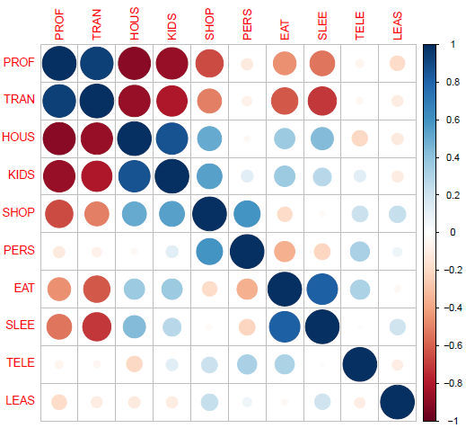
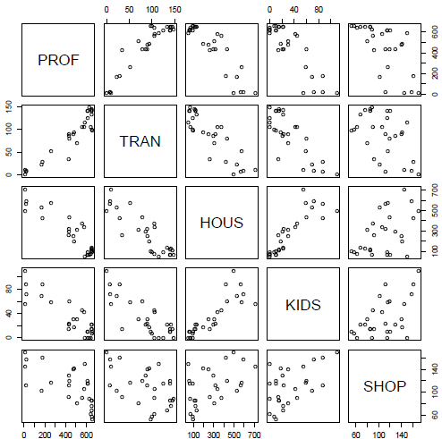
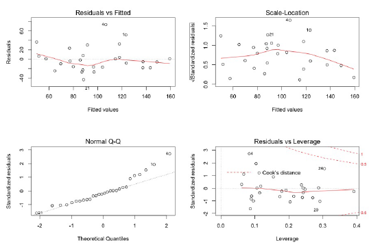
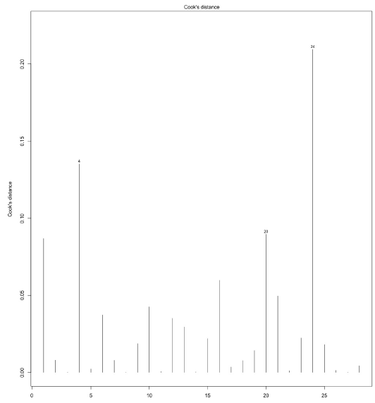
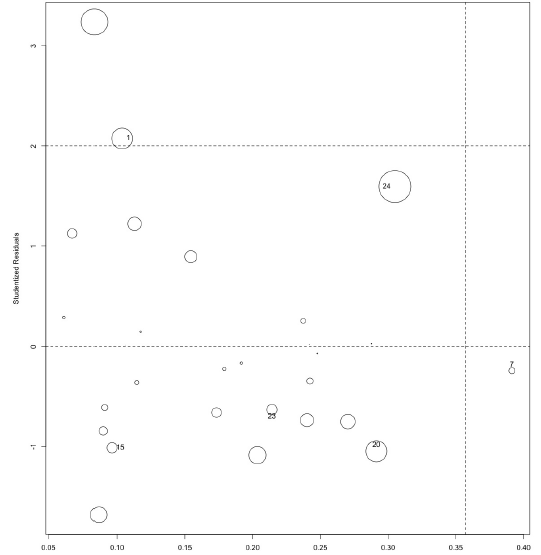
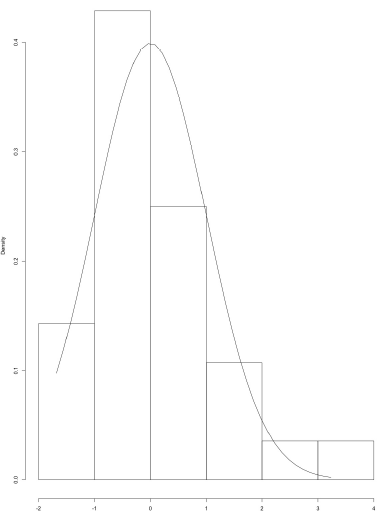
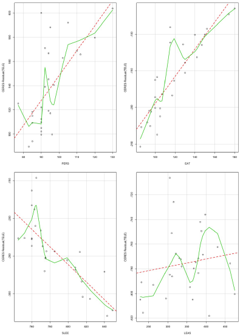

[](http://quantlet.de/index.php?p=info)

## [](http://quantlet.de/) **FAMmultivariateregression** [](http://quantlet.de/d3/ia)

```yaml

Name of QuantLet:  FAMmultivariateregression

Published in:      Factor Analysis and Multivariate Regression

Description:       Attempts prediction of one dependent variable TELE (amount of hours spent watching television) based on other variables in `Timebudget`

Keywords:          multivariate analysis, vif, graphical represtation, factor analysis, plot

Author:            Daria Fitisova, Maria Kozlova, Yihan Liu, Andrea Mina Weihe

Submitted:         Sat, Aug 13 2016 by Yihan Liu

```












```r

#  build a full model and check
attach (Timebudget2 )
Model1 = lm(TELE ~ PROF+TRAN+HOUS+KIDS+SHOP+PERS+EAT+SLEE+LEAS,
data=Timebudget )
l ibrary ( ' fmsb ' )
VIF(Model1 )
summary(Model1 )

#  look at the interdependencies between the variables
l ibrary ( ' c o r r p l o t ' )
c = cor (Timebudget )
c o r r p l o t ( c , method = " c i r c l e " )

#  construct scatterplots of pairs of variables
pairs (~PROF+TRAN+HOUS+KIDS+SHOP)

#  construct multivariate regression
Model2 = lm(TELE ~ PERS+EAT+SLEE+LEAS, data=Timebudget )
summary(Model2 )
lm( formula = TELE ~ PERS + EAT + SLEE + LEAS, data = Timebudget )

#  build diagnostic plots
layout (matrix( c ( 1 , 2 , 3 , 4 ) , 2 , 2 ) )
plot (Model2 )

#  perform a Bonferroni outlier test
l ibrary ( ' car ' )
o u t l i e rTe s t (Model2 )

#  present both outlyingness, leverage, as well as inuence of each point
i n f l u e n c ePl o t (Model2 , id .method=" i d e n t i f y " , main=" I n f l u e n c e Plot " , sub=" Ci r c l e s ")

#  prove the normality of residual
l i b r a r y (MASS)
sresid = s tudr e s (Model2 )
hist ( s r e s i d , f r e q=FALSE, main=" Di s t r i b u t i o n o f Student i z ed Re s idua l s " , br eaks=10)
x f i t = seq (min( s r e s i d ) ,max( s r e s i d ) , length=40)
y f i t = dnorm( x f i t )
l ines ( x f i t , y f i t )

#  perform test on the models assumptions
l ibrary ( ' gvlma ' )
gvmodel2 = gvlma (Model2 )
summary( gvmodel2 )

#  add each of the previously discarded variables
Model3Prof = lm(TELE ~ PROF+PERS+EAT+SLEE+LEAS, data=Timebudget )
Model3Tran = lm(TELE ~ TRAN+PERS+EAT+SLEE+LEAS, data=Timebudget )
Model3Hous = lm(TELE ~ HOUS+PERS+EAT+SLEE+LEAS, data=Timebudget )
Model3Kids = lm(TELE ~ KIDS+PERS+EAT+SLEE+LEAS, data=Timebudget )
Model3Shop = lm(TELE ~ SHOP+PERS+EAT+SLEE+LEAS, data=Timebudget )

#  created manually two dummy variables and regress
summary( ModelDummy)
lm( formula = TELE ~ PERS + EAT + SLEE + HOUS + GEND + GEO, data = TimebudgetD)
